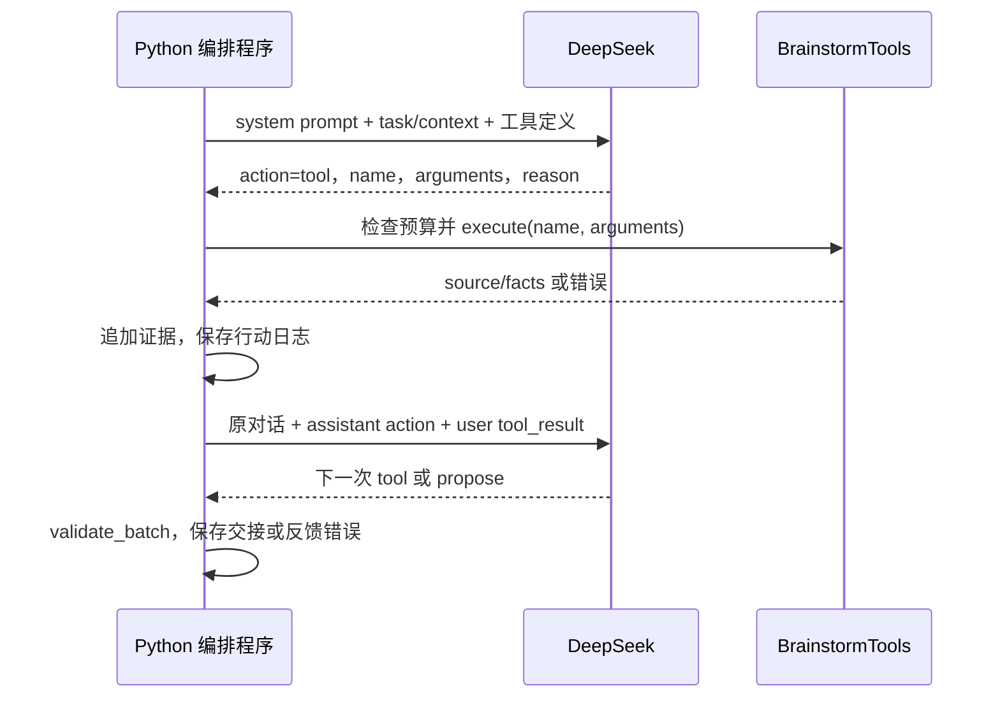

# 06：Brainstorm Agent——从论文机制到工具调用

本章整合任务契约、DeepSeek 生成、主动调查与行动日志。阅读这一篇就能完成本阶段，不需要来回切换三个文件。当前实现可以读取系统、实验和训练统计，生成并校验提案；实际修改代码和训练候选属于下一阶段 Developing，目前尚未实现。

## 1. 先把论文问题转成实现任务

阅读 [AgentX §4 与附录 C.1](https://arxiv.org/html/2606.26859v2#S4)。论文在本章的学习主线是：明确任务边界，调查证据，探索候选，再把可执行方案交给开发。本项目采用本地文件与 Python 函数实现这些职责；下面的 JSON 协议、固定预算和必读检查是教程工程选择。

| 实现步骤 | 论文对应与类型 | 本地输入 → 输出 | 代码位置 | 保留及简化 |
| --- | --- | --- | --- | --- |
| 明确任务 | §4.1；简化 | 人工范围 → TaskBoundary | configs/brainstorm-task.json、agents/brainstorm_contracts.py | 明确目标与约束；未自动澄清用户需求 |
| 准备初始事实 | §4.3；简化 | 父模型报告 → context | agents/brainstorm_context.py | 事实有来源；无动态证据权重 |
| 调查系统 | §4.3.2；简化 | 文件查询 → 系统证据 | tools/brainstorm.py | 读取真实代码；本地白名单替代工业系统 KB |
| 调查实验 | §4.3.1；简化 | run ID → 验证历史 | tools/brainstorm.py | 查询本地报告；尚无完整失败记忆 |
| 分析数据 | §4.3.3；简化 | 训练数据 → 分布统计 | tools/brainstorm.py | 真实统计；无工业 SQL |
| 小批候选 | §4.2；简化 | 调查上下文 → 三个候选 | agents/brainstorm.py | 成熟度与优先级；仅一批，无残余探索循环 |
| 校验与交接 | §4.4；简化 | 候选 → selected_proposal | agents/brainstorm_contracts.py | 结构化验证；不替代代码审查或生产人工审核 |
| 保存轨迹 | §3；工程支撑 | 每个动作 → 本地日志 | agents/activity_log.py | 可追溯；尚未接 SQLite |

§4.3.4 的外部论文检索仍未实现。每一步的验证方式在后文给出；提案合法不代表模型已经获得提升。

## 2. 建立清晰的模块分工

从仓库根目录阅读以下文件，路径均相对 `src/mini_agentx/`：

| 模块 | 要解决的问题 |
| --- | --- |
| cli.py | 解析命令，准备上下文、客户端和工具，启动 agent |
| agents/brainstorm_context.py | 从父实验挑选允许公开的事实 |
| agents/brainstorm_contracts.py | 定义任务、提案和交接的合法格式 |
| tools/brainstorm.py | 提供真实只读函数，校验工具名、参数和访问范围 |
| llm/client.py | 将 messages 发给 DeepSeek，解析 JSON，返回 usage 与延迟 |
| agents/brainstorm.py | 保存对话状态，路由动作，反馈结果，限制循环，校验提案 |
| agents/activity_log.py | 将动作、公开说明和结果按时间写入同一个文件 |

三个 agent 是三个职责边界，不要求启动三个进程。Brainstorm 的每次 `client.complete(messages)` 都是一次独立请求；程序把之前的请求和结果继续放入 messages，因此模型能基于上一轮观测选择下一步。

## 3. 第一步：定义允许优化的范围

修改 `configs/brainstorm-task.json`，再由 `TaskBoundary` 校验。当前目标是固定验证集上的 NDCG@10，每批三个候选，候选训练预算 60 秒。

| 字段 | 实现意义 |
| --- | --- |
| schema_version、task_id | 防止不同任务或格式被混用 |
| objective、primary_metric | 固定优化目标和比较口径 |
| allowed_files | 候选目录里的 model.py 与 training.toml |
| forbidden_changes | 数据划分、评估器、模拟器、测试结果、密钥、编排程序不可改 |
| constraints、unknowns | 记录执行条件与尚未知道的事实 |
| candidate_count、max_training_seconds | 限制提案数量与后续实验预算 |

**当前允许修改模型。** `model.py` 可改变表示与打分，但必须兼容现有训练接口；`training.toml` 可改 dimensions、learning_rate、batch_size、epochs、l2、threads。BPR 损失与负采样位于固定训练器，这一版不开放修改。可读文件和可改文件是两套权限，例如 agent 可以读 train.py，但不能把修改训练器的方案交接为当前可实施方案。

Brainstorm 只输出修改计划。60 秒是交接给未来训练工具的约束，当前并没有候选执行器来强制执行它；不要把文字约束当成已经落地的代码隔离。

## 4. 第二步：把父实验转成证据上下文

运行 `brainstorm-context` 可以单独学习这一层：

```bash
mini-agentx brainstorm-context --baseline-run <你的基线run_id>
```

`build_context` 校验父权重摘要，读取报告白名单，输出任务、parent_run_id、dataset_version、evidence、avoid_set。初始证据包括：

| evidence_id | 状态 | 内容 |
| --- | --- | --- |
| system-model | documented | 模型表示、维度、训练逻辑及修改范围 |
| baseline-validation | observed | 父实验真实验证指标、最佳轮次和耗时 |
| popularity-validation | observed | 热门推荐的真实验证结果 |

每条证据使用 `evidence_id/source/status/facts`。documented 表示系统描述，observed 表示程序观测，hypothesis 则属于后面的待验证提案。上下文没有测试指标、原始用户记录、完整 API 配置或私有模拟参数。avoid_set 当前通常为空，尚未自动从失败记忆生成。

验收：打开输出的 context.json，检查父实验和数据版本，找到真实验证数值，确认没有测试结果。

## 5. 第三步：把读取能力封装成工具

在 `BrainstormTools.SPECS` 描述工具输入；在 `execute(name, arguments)` 执行对应 Python 函数。SPECS 让模型知道可以请求什么，execute 才是真正执行动作的地方。

| 工具 | arguments | 返回内容 | 为什么要用 |
| --- | --- | --- | --- |
| list_files | {} | 可读文件路径 | 发现调查范围 |
| read_file | {"path":"白名单相对路径"} | path、content、sha256 | 理解模型接口和实现位置 |
| list_experiments | {} | 最多 30 个实验摘要 | 查找本地可参考实验 |
| read_experiment | {"run_id":"实验ID"} | 验证历史及训练参数，或模型模式模拟 A/B 观测 | 了解父模型表现与已有结果 |
| training_data_summary | {} | 用户、物品、交互量和流行度统计 | 给优化假设提供训练分布依据 |

read_file 白名单是 model.py、train.py、evaluate.py、configs/baseline.toml、configs/brainstorm-task.json；单文件最多 24,000 字节。工具校验参数字段、规范化路径和符号链接，拒绝任意 shell、.env、测试文件和 simulator_private.json。

read_experiment 只接受 baseline/ab 加 12 位十六进制 ID。训练报告只暴露指定字段；模拟 A/B 只开放 model 模式，去掉规则答案，并明确 simulated。人为注入“改善/恶化”的场景不能作为模型优化证据。

training_data_summary 读取父实验的 train.csv，先检查数据版本与摘要，再统计交互数、用户数、物品数、每用户交互分布、前十热门物品占比、交互不超过五次的物品数量。它不读取验证或测试标签，不返回原始用户 ID。

这些检查是 Python 工具接口边界；目前没有生成代码执行工具，因此不应声称已经实现通用执行沙箱。

## 6. 第四步：实现模型驱动的工具调用循环

当前采用 **JSON action 协议**，不是 DeepSeek 原生 function calling。API 返回普通 JSON，程序解释 action 并执行工具。这样可以先学习工具路由和状态传递，再决定是否升级接口。



例如模型请求读取模型文件：

```json
{
  "action": "tool",
  "name": "read_file",
  "arguments": {"path": "src/mini_agentx/recommender/model.py"},
  "reason": "确认模型表示与打分接口，判断方案应该落在哪个文件。"
}
```

这是协议示例，不是某一次调用的原始响应。程序按以下顺序处理：

1. 检查 action 字段、reason 类型与长度，以及工具预算。
2. `tools.execute` 校验工具名、参数与路径，执行真实读取。
3. 成功时构造 `tool-N` 证据，将它追加到 `context.evidence`。
4. 将模型 action 以 assistant 消息保存，将工具结果以 user 消息返回。
5. 再次调用模型，使新观测参与下一次选择。

工具结果的协议形状为：

```json
{
  "tool_result": {
    "evidence_id": "tool-1",
    "source": "system_kb",
    "status": "observed",
    "facts": {"path": "...", "content": "文件原文", "sha256": "..."}
  }
}
```

工具失败时返回 `tool_error`，保存拒绝原因，但不追加事实证据。失败的工具请求也占工具预算。tool-N 按请求序号产生，失败可能使成功证据的序号不连续。

下面是用于理解的伪代码，实际异常与持久化逻辑见 `generate_proposals`：

```python
messages = [system_prompt, context_message]
for _ in range(max_model_calls):
    action, metadata = client.complete(messages)
    if action["action"] == "tool":
        observation = execute_and_record(action)
        messages += [assistant(action), user(observation)]
        continue
    batch = action["batch"]
    handoff = validate_batch(batch, context)
    save_and_finish(batch, handoff)
    break
```

最低调查要求是成功读取模型文件、父实验与训练统计；程序用 inspected 集合检查三项是否完成，不强制三项的执行顺序。其他调查由模型选择。这个必读要求是教程约束，不是论文规定的固定动作列表。选中提案还必须引用至少一条本轮工具新获得的证据，防止调查后完全忽略观测。

reason 是一两句公开行动目的与依据，若提供必须是非空且不超过 1,000 字符；缺失时不编造。它帮助阅读日志，不是内部完整思维链，也不证明因果假设正确。

## 7. 第五步：生成可验证、可交接的候选

模型结束调查后返回 `{"action":"propose","batch":完整批次,"reason":"简短依据"}`。batch 包含 schema_version、task_id、parent_run_id 和 proposals。

| 每条提案字段 | 应该写什么 |
| --- | --- |
| proposal_id、title | 可引用的 ID 和标题 |
| mechanism_key、priority | 不重复的机制标识及唯一正整数优先级 |
| maturity | ready、probe_first 或 backlog |
| hypothesis | 待验证机制，不把猜测写成已证实原因 |
| evidence_refs | evidence_id、facts 的直接 field、原始类型的 value |
| changes | 候选文件及具体修改计划 |
| validation | 固定指标、方向、同数据同种子比较、观测项和证伪条件 |
| risks、probes | 风险及阻塞性调查 |

例如将维度从 32 改成 64，修改位置是 training.toml；若假设是“容量更大可能提高排序质量”，应以父验证指标作为对照，并写明没有提升或耗时越界时如何拒绝假设。物品数量和指标低并不能直接证明容量不足。

ready 必须有修改计划且 probes 为空；probe_first 必须给出阻塞性调查；backlog 保留暂不能实施的方向。最高优先级 ready 被选中；全批没有 ready 则 needs_evidence，不生成可执行 proposal.json。

`validate_batch` 检查版本、父实验、数量、字段、路径、白名单、指标、证据 ID/字段/值、重复 ID/机制/优先级以及 avoid_set。数值 32 与字符串 "32" 不可互换。任何一个候选非法会拒绝整个批次。

校验只能保证格式、范围和引用一致，不能证明引用支持因果假设、机制没有语义重复或修改计划一定可实施。历史真实调用曾将负采样修改放进 model.py：路径合法，但实现位置错误。后续 Developing 还需要读取代码、检查接口和训练验证。

## 8. 第六步：控制预算与失败修复

配置文件为 `configs/brainstorm-llm.toml`：

| 配置 | 当前值 | 实际含义 |
| --- | --- | --- |
| workflow.max_model_calls | 8 | 包含调查、提案、API 失败和修复的总请求次数 |
| workflow.max_tool_calls | 6 | 包含被执行后拒绝的工具请求 |
| llm.max_attempts | 2 | Brainstorm 中用于累计无效输出上限，不是每个动作再重试两遍 |
| llm.max_tokens | 4500 | 每次响应的输出上限 |
| llm.timeout_seconds | 45 | 每次网络请求超时 |

客户端一次 complete 发一次请求，循环负责重试。无效 action 或批次返回明确校验错误，追加到 messages，让模型在剩余预算内修复。达到两次无效输出停止；不可恢复 HTTP 4xx 停止，429 与网络错误可在总预算内继续。预算耗尽仍无合法批次则 failed，保留诊断而不伪造成功。

DeepSeek 客户端只从环境变量/.env 读取密钥，环境变量优先。密钥用于认证 header，不进入 prompt 和日志。JSON 输出模式只帮助解析；合法 JSON 仍须通过以上检查。

## 9. 运行一次，并按日志学习

先完成数据与基线，配置项目根目录的 .env，再执行：

```bash
conda activate mini-agentx
mini-agentx brainstorm --baseline-run <你的基线run_id>
```

本机已有基线 `baseline-c30ead6da742`；其他机器需要自己的 ID。默认使用 brainstorm-task.json 与 brainstorm-llm.toml，可通过 --task、--llm-config 覆盖；也可传 --context 使用已有上下文，与 --baseline-run 互斥。

打开命令输出的 activity_log 路径，按下面的顺序阅读：

1. 开始任务：确认目标、权限与父实验。
2. 请求工具：看公开说明，判断它希望获取什么证据。
3. 工具结果：核对真实返回是否回答了问题。
4. 候选批次：检查假设如何引用证据，有没有把猜测当成事实。
5. 校验与交接：确认选中原因，记下还需要下游验证的风险。

本地真实运行 `brainstorm-463feb9fa5af` 使用 5 次模型调用、4 次工具调用，读取模型、父实验、训练统计和实验列表，随后生成三个候选，选中维度 32→64。候选未训练，没有收益结论。模型和新 run ID 每次可能不同，历史运行目录不随仓库发布。

## 10. 理解每个产物在闭环中的作用

产物位于 `runs/brainstorm-<id>/`，均留在本地：

| 文件 | 阅读或下游用途 |
| --- | --- |
| activity.md | 单文件时间线，逐事件写入，可在运行中查看；UTC+08 |
| activity.jsonl | 对应结构化事件，便于以后可视化 |
| context.json | 初始上下文加本轮成功调查证据 |
| tools.json | 工具参数、公开理由、成功结果与拒绝原因 |
| trace.json | system prompt、模型响应、usage、延迟与校验错误 |
| proposals.json | 通过契约的完整批次 |
| handoff.json | 选择结果、父实验与数据版本 |
| proposal.json | 有 ready 时的下游输入，携带 task、父实验、数据版本与选中提案 |
| status.json | ready、needs_evidence 或 failed |

消息可由初始证据、工具请求/结果和修复错误重建，trace 不是每次完整 messages 的独立快照。API 密钥与内部思维链均不记录。旧运行不会凭空获得新的公开行动理由。

## 11. 检查自己是否理解，并验证实现

```bash
mini-agentx check-proposals --context examples/brainstorm/context.json --proposals examples/brainstorm/proposals.json
python -m unittest discover -s tests -v
```

examples 是标记 synthetic_example 的手写教学数据，不是 LLM 真实响应。测试使用 mock 覆盖有限修复、无 ready、预算失败、越界工具、证据引用和行动日志等路径；真实 API 运行单独记录，不能混为一类证据。

学习验收：你应能解释是谁执行工具、工具结果如何进入下一次请求、为什么不能改评估器、ready 与效果已验证有什么区别、失败为什么也要保存。尝试沿 activity.md 的一个 evidence_id 找到 proposal.json 中的引用，核对字段与类型；再阅读 execute 和 generate_proposals 对应分支。

## 12. 接下来如何接 Developing

下一章输入是 proposal.json。计划创建独立候选目录，复制父模型和配置，提供读取/写入候选文件、检查接口、固定训练入口和读取诊断的工具，复用“请求工具 → 执行 → 返回 → 再请求”的循环。训练后把实际指标交给 Evaluation，再写实验记忆。

这些工具和完整闭环尚未实现。下一章必须落实执行隔离、超时与修复边界；当前只读工具的白名单不能直接当作生成代码执行的隔离方案。
